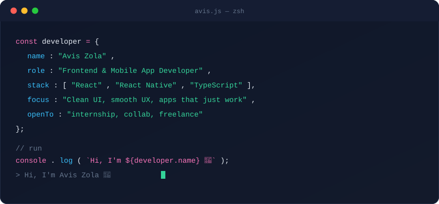
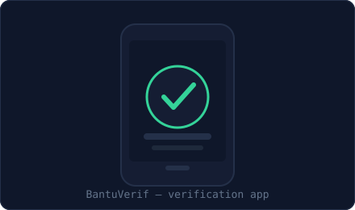
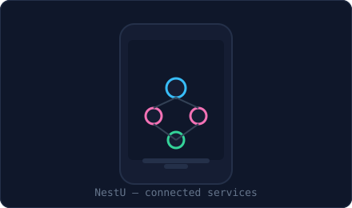

<p align="center">
  
</p>

<p align="center">
  
  <a href="https://www.linkedin.com/in/avis-zola-raditya-kurniawan-407388377/"></a>
  <a href="mailto:zolaziyan2616@gmail.com"></a>
  <a href="https://avis-zola.vercel.app/"></a>
</p>

<br>

### `$ cat about.md`

Saya membangun antarmuka — web maupun mobile — yang terasa cepat, rapi, dan gampang dipakai. Lebih suka merapikan satu komponen sampai benar-benar pas daripada mengejar fitur sebanyak-banyaknya asal jadi.

Saat ini fokus di **Flutter**, **React**, dan **TypeScript**, sambil terus mengasah sisi desain (UI/UX) supaya kode yang saya tulis juga enak dilihat, bukan cuma jalan.

<br>

### `$ ls skills/`

```yaml
mobile:
  - Flutter
  - Dart
  - React Native

frontend:
  - React
  - TypeScript
  - Next.js
  - Tailwind CSS

tooling:
  - Git & GitHub
  - Figma
  - VS Code
```

<br>

### `$ ls projects/ --pinned`

<table>
<tr>
<td width="50%" valign="top" align="center">



**📱 BantuVerif**
Aplikasi untuk membantu proses verifikasi data/dokumen secara digital agar lebih cepat dan efisien.

`TypeScript`

</td>
<td width="50%" valign="top" align="center">



**📦 NestU**
Layanan/aplikasi yang menghubungkan beberapa kebutuhan pengguna dalam satu sistem terpusat.

`TypeScript`

</td>
</tr>
</table>

<sub>ℹ️ Deskripsi di atas gambaran umum berdasarkan nama repo — ganti kapan saja lewat README masing-masing repo kalau mau lebih spesifik.</sub>

<br>

### `$ git log --stat --author=aviszola`

<p align="center">
  
  
</p>

<p align="center">
  
</p>

<br>

<p align="center"><sub>// thanks for reading this far — let's build something 🚀</sub></p>
